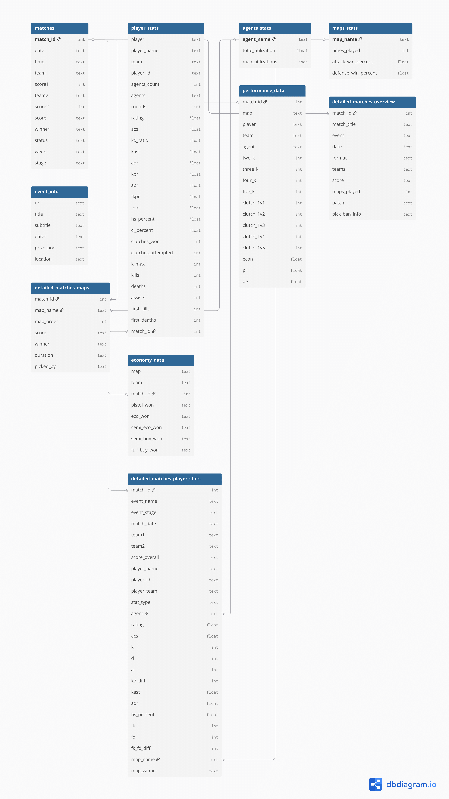

# 🎯 Valorant Tournament Data Analytics

This project analyzes **Valorant Champions 2024 Seoul** match & player data using **PostgreSQL, Python, and Apache Superset**.
It demonstrates a full data pipeline: **data cleaning → database design → SQL analytics → visualization**.

---


## 🚀 Project Overview

We act as a fictional company **Esports Data Insights Inc.**, providing competitive analysis for Valorant tournaments.
Our goal is to help teams, coaches, and fans better understand performance trends by analyzing:

* Player performance (kills, assists, ratings, clutch success)
* Team results and win rates
* Map popularity and win distributions
* Agent pick/utilization patterns
* Economy round win rates

---

## 📂 Repository Structure

```
valorant_tournament_data_analytics/
│
├── dataset/                # Raw dataset (CSV files, uncleaned)
├── dataset_clean/          # Cleaned dataset (ready for PostgreSQL)
│
├── superset/               # Superset docker-compose.yml
│   └── docker-compose.yml
│
├── main.py                 # Python script (runs queries, prints results)
├── queries.sql             # All analytical SQL queries (12+)
│
├── .gitignore              # Git ignored files (.env, etc.)
│
└── README.md               # This file
```

---

## 🛠️ Tools & Technologies

* **Python** (pandas, psycopg2, dotenv) – data cleaning & DB connection
* **PostgreSQL** – relational database for structured data storage
* **pgAdmin 4** – database administration & ER diagram
* **Apache Superset** (Docker) – interactive dashboards & visualization
* **VS Code** – development environment

---

## 📊 Entity Relationship Diagram

Database schema for cleaned Valorant dataset (10 tables).



---

## 📈 Analytical Topics

We prepared 12 main queries in [`queries.sql`](queries.sql).
Highlights include:

1. Total matches & players count
2. Top players by kills
3. Top 10 players by rating (min 100 rounds)
4. Clutch success rates (%)
5. Team standings by matches won
6. Average ACS (combat score) per team
7. Map popularity (times played)
8. Picked team win % by map
9. Agent usage overall
10. Agent usage on Bind (JSON query)
11. Top players by assists
12. Average rating by event

---

## 🐍 Python Script (`main.py`)

The script connects to PostgreSQL using credentials from `.env`, runs selected queries, and prints results:

```bash
python main.py
```

Sample output:

```
Top 10 players by rating (min 100 rounds):
   player_name   team   avg_rating   total_rounds
0  TenZ         SEN    1.27          215
1  Derke        FNC    1.24          202
...
```

---


## ⚙️ Setup Instructions

### 1. Clone repository

```bash
git clone https://github.com/YOUR_USERNAME/valorant_tournament_data_analytics.git
cd valorant_tournament_data_analytics
```

### 2. Create Python environment

```bash
python -m venv venv
venv\Scripts\activate   # Windows
pip install -r requirements.txt
```

### 3. Configure PostgreSQL

* Create database: `valorant_tournament`
* Run `create_tables.sql` to create schema
* Import cleaned CSVs with `COPY` or pgAdmin

### 4. Environment Variables

Create a `.env` file (not committed to GitHub):

```
PGDATABASE=valorant_tournament
PGUSER=postgres
PGPASSWORD=yourpassword
PGHOST=localhost
PGPORT=5432
```

### 5. Run Python queries

```bash
python main.py
```

---

## 🔒 Security Note

* Database credentials are stored in `.env` (ignored by Git).

---

## 👨‍🎓 Authors

Project developed as part of **Data Visualization** course assignment.
By Maral Abay — 2025.

---

## ⭐ Acknowledgements

* Dataset: scraped Valorant Champions 2024 Seoul (public esports data)
* Tools: [Apache Superset](https://superset.apache.org/), [PostgreSQL](https://www.postgresql.org/), [pandas](https://pandas.pydata.org/)

